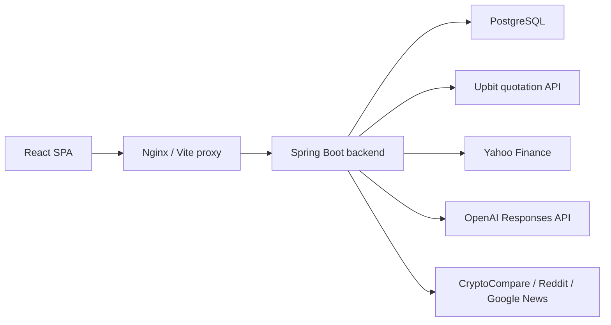

# Architecture

## Overview

ticoin은 React SPA, Spring Boot API, PostgreSQL로 구성됩니다. 코인 시세는 업비트 KRW 마켓을 우선 사용하고, 주식 시세는 Yahoo Finance 경로를 유지합니다. AI 분석은 백엔드에서 OpenAI Responses API를 호출하며 API 키는 서버 환경변수로만 관리합니다.

## Backend

- `client`: Upbit, Yahoo, CoinGecko fallback, news, OpenAI clients
- `controller`: REST endpoints under `/api`
- `service`: business logic, scheduled jobs, cache boundaries
- `entity` and `repository`: JPA persistence
- `websocket`: STOMP price and alert broadcasts
- `db/migration`: Flyway schema migrations

Market flow:

1. `MarketController` receives `/api/market/*`.
2. `MarketService` routes crypto requests to `UpbitClient`.
3. Stock requests continue through `YahooFinanceClient`.
4. The response shape remains `AssetDto` and `CandleDto`.

AI flow:

1. `AiController` receives `/api/ai/analyze`.
2. `AiAnalysisService` loads recent news context.
3. `OpenAiClient` calls `/v1/responses`.
4. The frontend receives a plain Korean summary.

## Frontend

- `layouts/RootLayout.jsx`: sidebar, header, bottom navigation shell
- `stores/marketStore.js`: feed, flashes, price merging
- `api/market.js`: REST API wrappers
- `components/AssetCard.jsx`: chart, price, social controls
- `components/AssetDetailModal.jsx`: detailed chart and add actions

The frontend no longer connects directly to an exchange API. It uses backend REST and STOMP so data source policy stays server-controlled.

## Database

The database stores user-owned data only:

- `portfolio`
- `watchlist`
- `price_alert`
- `profile`
- `comment`
- `users`
- `post`
- `post_like`
- `follow`

Market quotes and candles are cached in memory only.

## Deployment

Docker Compose runs three services:

- `postgres`
- `backend`
- `frontend`

Development frontend is served on `5175`; Docker nginx is served on `5174`. PostgreSQL is exposed on `5434 -> 5432`.
