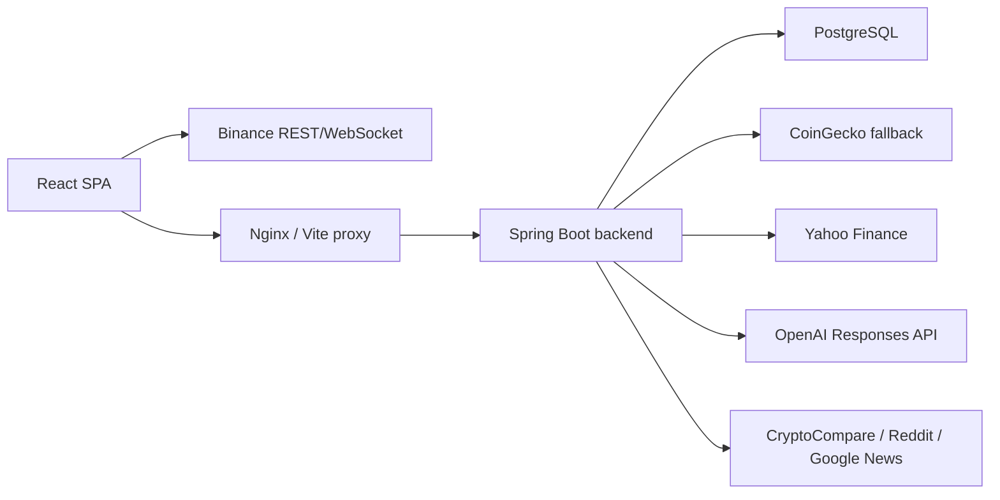

# Architecture

## Overview

Ticoin is a React SPA with a Spring Boot API and PostgreSQL persistence. Crypto cards receive live Binance ticker and kline updates in the browser. The backend provides seed and fallback market data, user-owned data, AI analysis, and STOMP broadcasts.

## Backend

- `client`: CoinGecko, Yahoo, news, OpenAI clients
- `controller`: REST endpoints under `/api`
- `service`: market seed data, AI analysis, user workflows
- `entity` and `repository`: JPA persistence
- `websocket`: STOMP price and alert broadcasts
- `db/migration`: Flyway schema migrations

Market flow:

1. `MarketController` receives `/api/market/*`.
2. `MarketService` routes crypto seed data to `CoinGeckoClient`.
3. Stock requests continue through `YahooFinanceClient`.
4. The frontend upgrades crypto prices and candles with Binance WebSocket streams.

AI flow:

1. `AiController` receives `/api/ai/analyze`.
2. `AiAnalysisService` loads recent news context.
3. `OpenAiClient` calls `/v1/responses`.
4. The frontend receives a Korean summary.

## Frontend

- `useBinanceTicker`: live crypto price updates through Binance ticker streams
- `useBinanceKlines`: initial Binance candles plus live kline updates
- `stores/marketStore.js`: seed data, live merges, flash state
- `components/AssetCard.jsx`: live chart, price, social controls
- `components/AssetDetailModal.jsx`: full-size live chart and add actions

## Database

The database stores user-owned data only:

- `portfolio`
- `watchlist`
- `price_alert`
- `profile`
- `comment`
- `users`
- `post`
- `post_like`
- `follow`

Market quotes and candles are not persisted.

## Deployment

Docker Compose runs:

- `postgres`
- `backend`
- `frontend`

Development frontend runs on `5175`; Docker nginx runs on `5174`. PostgreSQL is exposed on `5434 -> 5432`.
